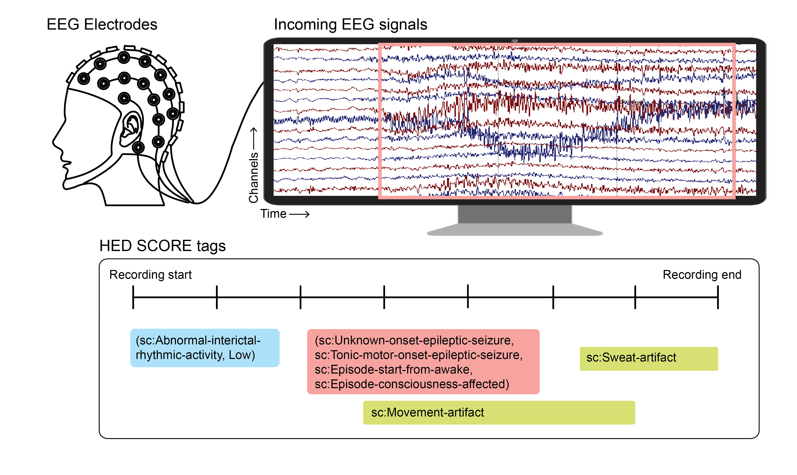

# HED SCORE schema

Sharing data in standardized, reproducible formats enables powerful mega-analyses that advance neuroscience. In the clinical setting of epilepsy research, the standardization of clinical terminology of electrophysiological events holds great potential for large-scale computation. Machine readability of electrophysiological event annotations is key to allow analyses across various tools and packages. The Standardized Computer-based Organized Reporting of EEG (SCORE)[1],[2] standard is a textual description for annotating EEG and ictal clinical events using standardized terms.

In this study, we make the SCORE standard machine-readable using the Hierarchical Event Descriptor (HED) library schema. HED library schemas allow researchers to extend the standard HED schema vocabulary by supporting specialized vocabularies. Our SCORE standard implementation in HED tackles the SCORE textual reports’ lack of machine readability and makes the SCORE standard available and machine-readable by open-source software.

We show several examples of annotations using the HED-SCORE library schema in the Brain Imaging Data Structure (BIDS). The HED-SCORE library schema can be used by many researchers worldwide to annotate electrophysiology measurements from the human brain.

## Development of HED SCORE

The HED-SCORE library schema maintains the hierarchy as presented in SCORE papers [1,2]. With the GitHub commit history reflecting the development process of the HED-SCORE library schema.

In the HED standard schema, top levels identify events of interest. Annotating events includes identifying graphoelements and their morphology, which can be followed by location, features related to time, and the effect of modulators. The top levels of the HED-SCORE library schema correspond to the main types of events described in the SCORE papers.

The SCORE HED schema library is intended to describe all normal and abnormal EEG features. Therefore, description of patient information, referral and recording condition information, administrative data, and continuous EEG monitoring in neonates is beyond this scope.

## Validation
The HED schema library for SCORE was converted and validated using the HED tools. See more [here](https://hedtools.ucsd.edu/hed).

## Brain imaging data structure (BIDS)
HED schema library for SCORE is compatible with the BIDS human and machine-readable events annotations .tsv files. 
For more information see the [Hierarchical Event Descriptors](https://bids-specification.readthedocs.io/en/stable/99-appendices/03-hed.html#appendix-iii-hierarchical-event-descriptors) appendix of the BIDS specification.
An implementation example using HED schema library for SCORE annotations is available
[here](https://github.com/bids-standard/bids-examples).

## References

[1]: Beniczky, Sándor, et al. "Standardized computer‐based organized reporting of EEG: SCORE." Epilepsia 54.6 (2013): 1112-1124.

[2]: Beniczky, Sándor, et al. "Standardized computer-based organized reporting of EEG: SCORE–second version." Clinical Neurophysiology 128.11 (2017): 2334-2346.

[3]: *Manuscript: Tal Pal Attia et al., (in prep). "Hierarchical Event Descriptor library schema for clinical EEG data annotation".*